# Forge — Application Synopsis & Use Cases

## 1. Executive Summary

**Forge** is a role-based gym management platform designed to streamline gym operations for **Owners**, empower **Trainers** to deliver personalized fitness programs, and keep **Members** engaged through gamified workout tracking. The app follows a minimalistic design philosophy — every feature is purposeful, every interaction is fast, and every insight is actionable.

### Target Users
| Role | Who They Are | Primary Need |
|---|---|---|
| **Owner** | Gym founders, managers, franchise operators | Business visibility, revenue control, member retention |
| **Trainer** | Personal trainers, group class instructors | Client management, plan customization, progress tracking |
| **Member** | Gym-goers (regular & PT clients) | Workout tracking, motivation, attendance convenience |

---

## 2. System Architecture

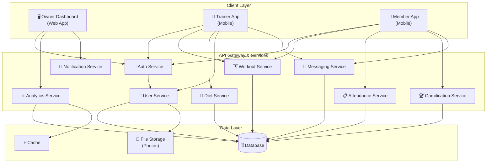

---

## 3. Data Model (Entity Relationship)

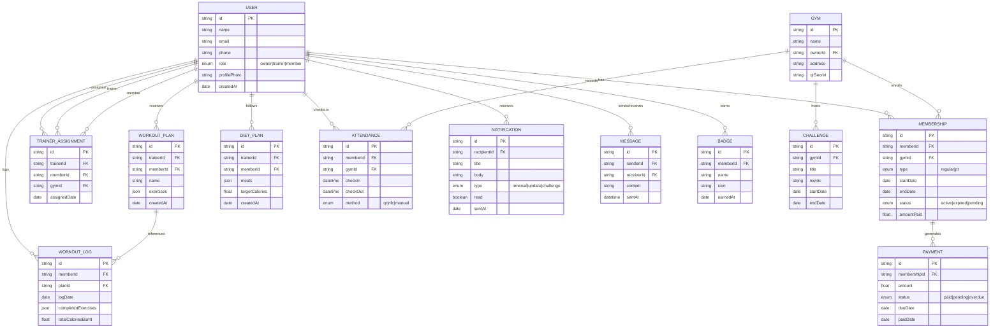

---

## 4. Use Case Diagrams

### 4.1 Owner Use Cases

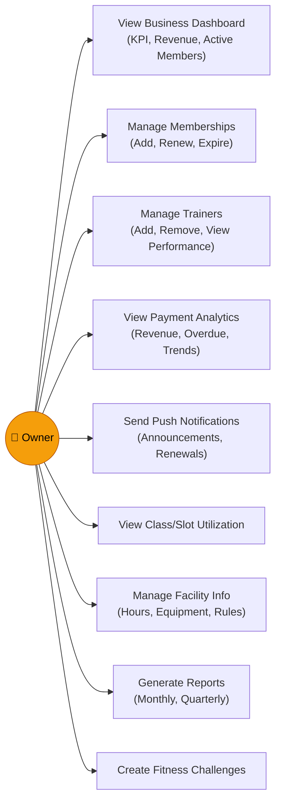

### 4.2 Trainer Use Cases

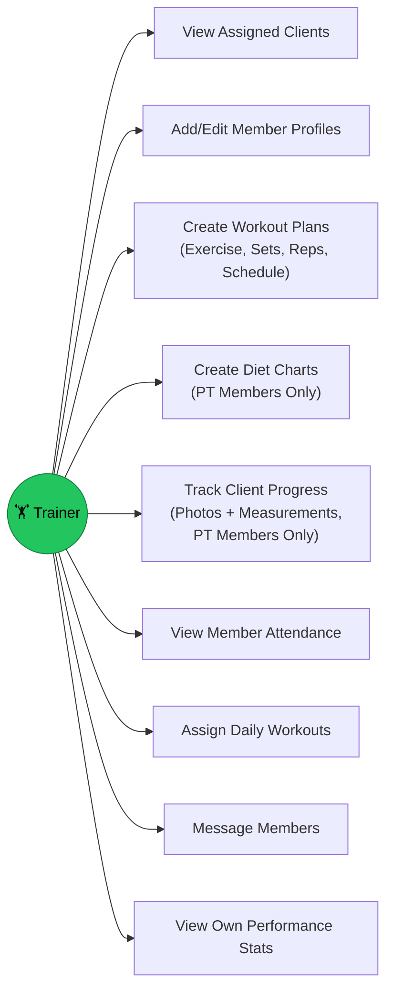

### 4.3 Member Use Cases

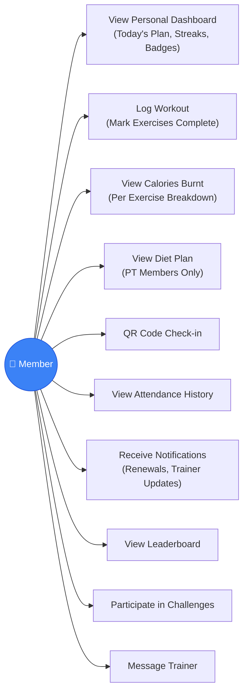

---

## 5. Core User Flows

### 5.1 Member Daily Workout Flow

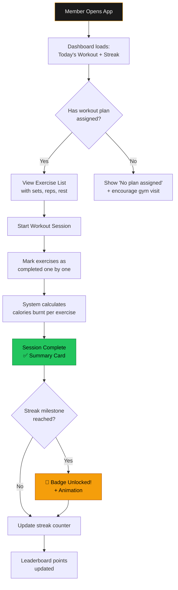

### 5.2 Trainer Creating a Workout Plan

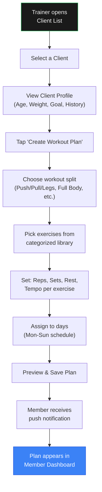

### 5.3 QR Attendance Check-in Flow

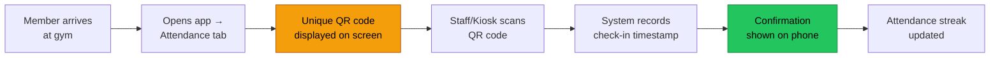

### 5.4 Owner Revenue Analytics Flow

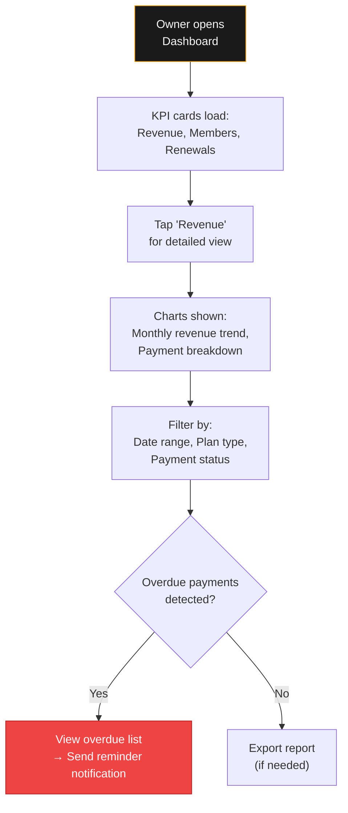

---

## 6. Module Feature Matrix

| Feature | Owner | Trainer | Member (Regular) | Member (PT) |
|---|:---:|:---:|:---:|:---:|
| Business Dashboard | ✅ | — | — | — |
| Member Directory | ✅ | ✅ (assigned only) | — | — |
| Trainer Directory | ✅ | — | — | — |
| Payment Analytics | ✅ | — | — | — |
| Push Notifications (Send) | ✅ | — | — | — |
| Facility Management | ✅ | — | — | — |
| Workout Plan Builder | — | ✅ | — | — |
| Diet Chart Builder | — | ✅ (PT clients) | — | — |
| Progress Tracker | — | ✅ (PT clients) | — | — |
| Client Attendance View | — | ✅ | — | — |
| Personal Dashboard | — | — | ✅ | ✅ |
| Workout Log | — | — | ✅ | ✅ |
| Calories Burnt Card | — | — | ✅ | ✅ |
| Diet Plan Viewer | — | — | — | ✅ |
| QR Check-in | — | — | ✅ | ✅ |
| Attendance History | — | — | ✅ | ✅ |
| Leaderboard | — | — | ✅ | ✅ |
| Challenges | — | — | ✅ | ✅ |
| Streaks & Badges | — | — | ✅ | ✅ |
| In-App Messaging | — | ✅ | ✅ | ✅ |
| Notifications (Receive) | — | ✅ | ✅ | ✅ |

---

## 7. Gamification System

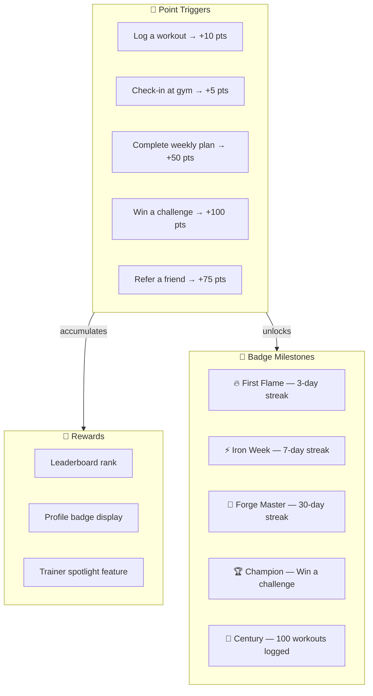

---

## 8. Notification System Map

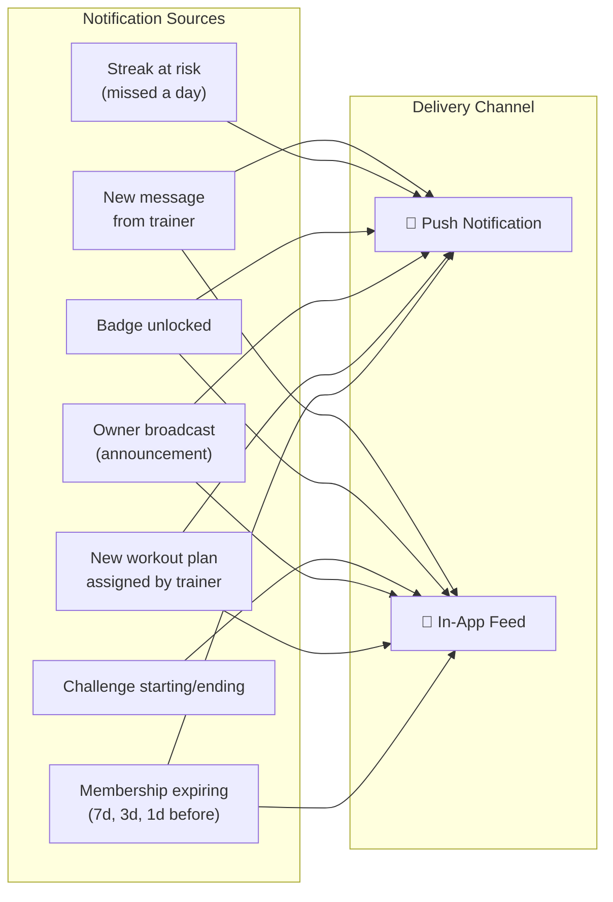

---

## 9. Calorie Estimation Logic

The **Calories Burnt** card uses the standard **MET (Metabolic Equivalent of Task)** formula:

> **Calories = MET × Weight (kg) × Duration (hours)**

| Exercise | MET Value | Example (75 kg, 30 min) |
|---|:---:|:---:|
| Bench Press | 6.0 | 225 kcal |
| Squats | 5.5 | 206 kcal |
| Deadlifts | 6.0 | 225 kcal |
| Running (treadmill) | 9.8 | 368 kcal |
| Cycling (stationary) | 7.0 | 263 kcal |
| Yoga | 3.0 | 113 kcal |
| Jump Rope | 12.3 | 461 kcal |
| Plank (static) | 3.8 | 143 kcal |

This is calculated automatically per exercise when a member logs their workout, and summed into a daily total on the dashboard.

---

## 10. Deployment Topology (Future State)

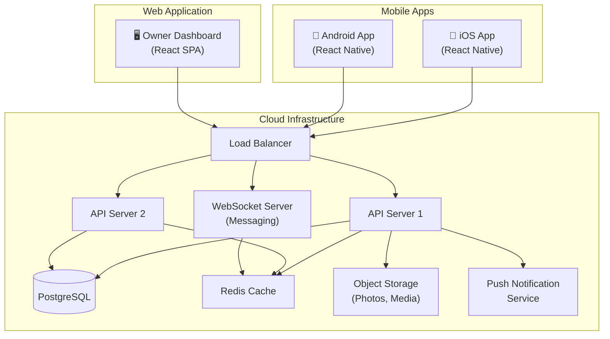
