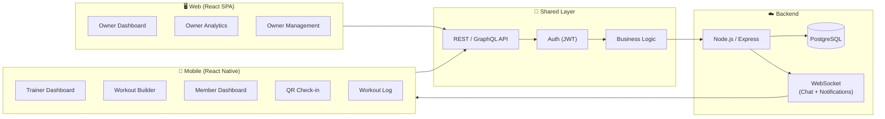
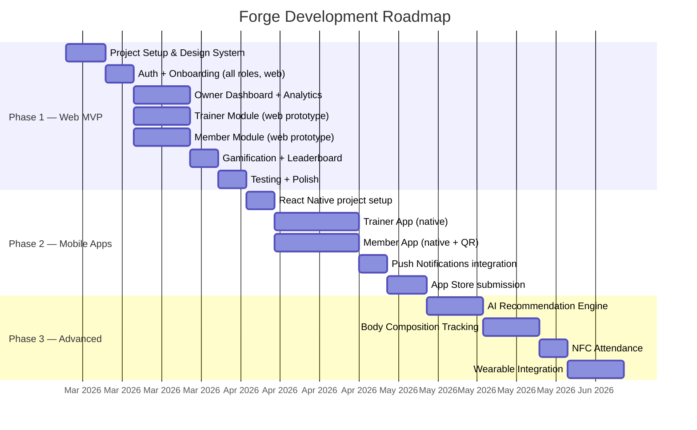
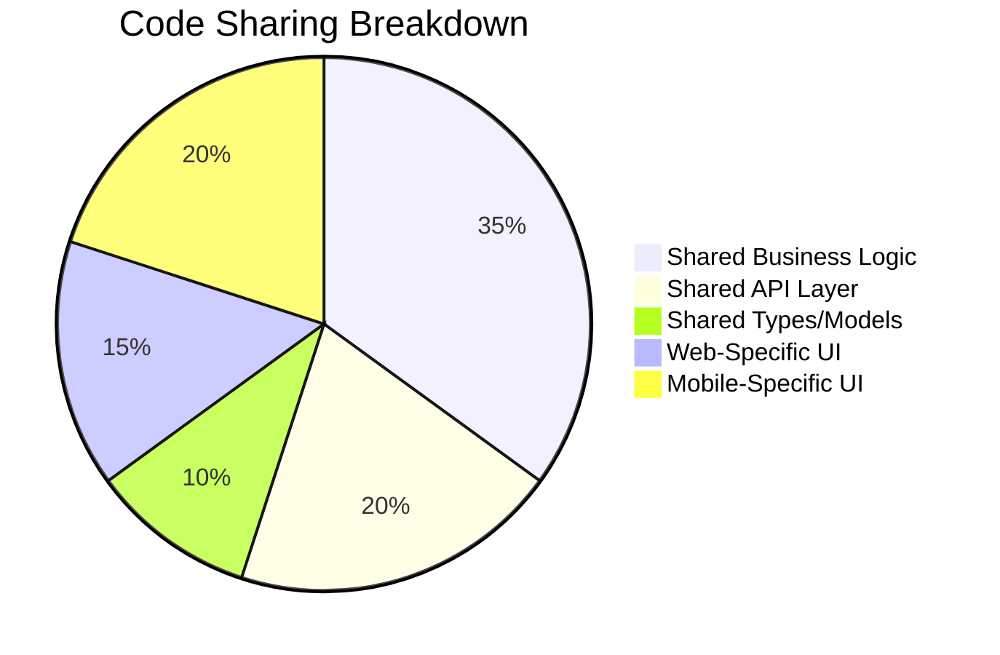
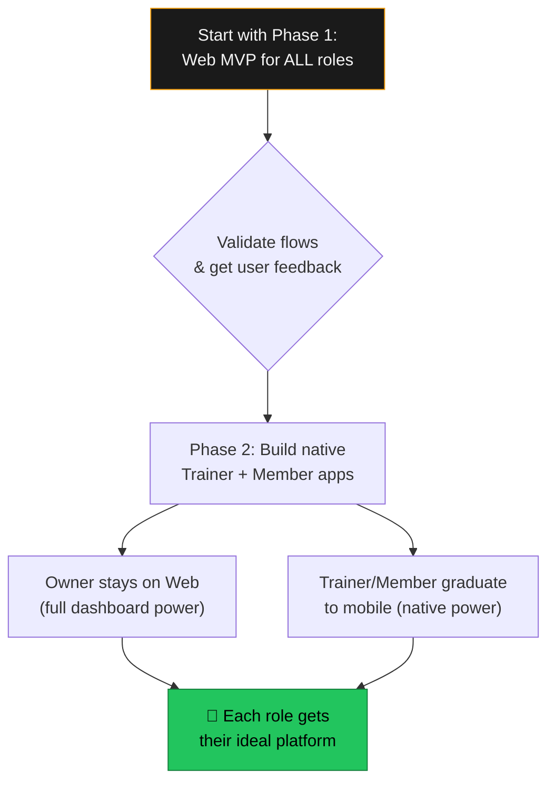

# Forge — Platform Strategy: Web vs. Mobile Split

## The Question

> Should the **Owner module** be a web application while the **Trainer and Member modules** are mobile applications?

---

## TL;DR Verdict: **Yes — This Split Is Recommended** ✅

The Owner's workflow is **analytical and desk-based** (dashboards, reports, spreadsheets). Trainers and Members operate **on the gym floor** with their phones. Matching the platform to the usage context is the single most impactful UX decision for Forge.

---

## 1. Behavioral Justification

| Role | When They Use Forge | Where They Are | Primary Actions | Best Platform |
|---|---|---|---|---|
| **Owner** | Morning review, end-of-day reports, monthly planning | Office / desk / laptop | View charts, manage lists, export reports, compose notifications | 🖥️ **Web** |
| **Trainer** | Between sessions, on the gym floor, during client meetings | Walking around, standing | Quick client lookup, assign workout, log measurements, snap progress photos | 📱 **Mobile** |
| **Member** | At the gym, before/after workouts, on commute | Gym floor, locker room, home | QR check-in, log exercises, view plan, check leaderboard, chat trainer | 📱 **Mobile** |

> [!IMPORTANT]
> The Owner rarely needs the app in their pocket. Trainers and Members **always** need it in their pocket. Building mobile-first for the wrong role wastes resources; building web-only for the gym floor kills adoption.

---

## 2. Comparative Study

### Option A: Everything as a Web App (Unified SPA)

| ✅ Pros | ❌ Cons |
|---|---|
| Single codebase, one deployment | No push notifications without workarounds (PWA has limits) |
| Faster initial development | No camera/NFC/QR native access |
| No app store approvals needed | Poor gym-floor UX on mobile browser |
| Easier to update (no app updates) | No offline capability |
| Lower cost for MVP | Members unlikely to bookmark a web app |
| | Can't leverage device sensors (accelerometer, etc.) |
| | No home screen presence = low retention |

### Option B: Everything as a Mobile App

| ✅ Pros | ❌ Cons |
|---|---|
| Great gym-floor experience | Owner dashboards are cramped on mobile screens |
| Native push notifications | Reviewing large tables/reports is painful |
| Camera, QR, NFC access | Owner doesn't need an app — they need a dashboard |
| Offline capability | Higher development cost |
| Home screen presence | App store review cycles slow down releases |
| | Desktop experience entirely lost |

### Option C: Owner = Web, Trainer/Member = Mobile (Recommended ✅)

| ✅ Pros | ❌ Cons |
|---|---|
| Each role gets the ideal platform | Two codebases to maintain |
| Owner gets full-width dashboards and charts | Shared backend required |
| Trainer/Member get native camera, QR, push | Slightly higher initial cost than web-only |
| Mobile presence drives member retention | Need app store approvals for mobile |
| Can share 60-70% of business logic | |
| Scales naturally to multi-branch | |
| Better perceived quality | |

---

## 3. Hybrid Architecture

---

## 4. Phased Implementation Roadmap

### Phase Breakdown

| Phase | Duration | Deliverables |
|---|---|---|
| **Phase 1: Web MVP** | ~6 weeks | Full Owner dashboard, functional Trainer & Member modules in web (usable immediately; serves as prototype for mobile) |
| **Phase 2: Mobile Apps** | ~6 weeks | Native Trainer & Member apps with camera, QR, push notifications. Owner continues on web. |
| **Phase 3: Advanced** | ~5 weeks | AI engine, body composition, NFC, wearables |

> [!TIP]
> **Phase 1 doubles as a prototype.** By building all three modules as a web app first, you validate every user flow before investing in native mobile. The Owner module stays as web permanently; Trainer & Member modules graduate to native apps in Phase 2.

---

## 5. Tech Stack Mapping

| Layer | Owner (Web) | Trainer (Mobile) | Member (Mobile) | Shared |
|---|---|---|---|---|
| **Framework** | React (Vite) | React Native | React Native | — |
| **UI Library** | Custom CSS | React Native Paper | React Native Paper | Design tokens |
| **Navigation** | React Router | React Navigation | React Navigation | — |
| **State** | Context + useReducer | Context + useReducer | Context + useReducer | Same patterns |
| **API Client** | Fetch / Axios | Fetch / Axios | Fetch / Axios | Same service layer |
| **Charts** | Recharts | Victory Native | Victory Native | — |
| **Camera** | — | react-native-camera | react-native-camera | — |
| **QR/NFC** | — | react-native-qrcode | react-native-qrcode | — |
| **Push** | — | Firebase FCM | Firebase FCM | — |
| **Backend** | Node.js + Express | ← same | ← same | PostgreSQL, Redis |

### Code Sharing Strategy

~65% of non-UI code is shared across platforms via a common `packages/shared` module.

---

## 6. Risk Analysis

| Risk | Likelihood | Impact | Mitigation |
|---|---|---|---|
| Mobile development delays | Medium | High | Phase 1 web app covers all roles as fallback |
| App store rejection | Low | Medium | Follow guidelines strictly; no restricted APIs |
| Code drift between web & mobile | Medium | Medium | Shared package for business logic, types, API |
| Owner wants mobile access | Low | Low | PWA wrapper or responsive web as bridge |
| Trainer prefers web on tablet | Low | Low | React Native works on tablets natively |

---

## 7. Cost Comparison (Estimated)

| Approach | Dev Time | Relative Cost | User Satisfaction |
|---|---|---|---|
| **Web Only** | 6-8 weeks | 💰 Low | ⭐⭐⭐ (Owners happy, others limited) |
| **Mobile Only** | 10-14 weeks | 💰💰💰 High | ⭐⭐⭐ (Trainers/Members happy, Owner cramped) |
| **Hybrid Split** ✅ | 12-16 weeks | 💰💰 Medium | ⭐⭐⭐⭐⭐ (Everyone gets ideal platform) |

> [!NOTE]
> The hybrid approach costs ~30% more than web-only but delivers significantly better UX for Trainers and Members — who are 90% of your daily active users.

---

## 8. Recommendation Summary

**Build web first for speed. Migrate Trainer/Member to mobile for quality. Keep Owner on web forever.** This is the most cost-effective path that maximizes user satisfaction across all three roles.
